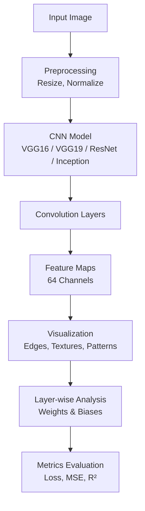

# 🧠 CNN Feature Visualization Tool

A deep learning visualization system that analyzes and visualizes how **Convolutional Neural Networks (CNNs)** extract features across layers.  
This project focuses on understanding **what CNNs learn internally** by visualizing feature maps, weights, and layer-wise behavior across popular architectures.

---

## 🚀 Project Overview

This tool explores how CNN architectures progressively learn **edges, textures, shapes, and spatial hierarchies** from images.  
Instead of treating CNNs as black boxes, the project exposes internal representations to improve interpretability and debugging of deep learning models.

---

## 🧩 Supported Models
- VGG16  
- VGG19  
- ResNet  
- Inception  

---

## 🔄 System Flow (Clear & Visual)



---

## ✨ Key Features

- Visualization of **64-channel feature maps** from convolutional layers  
- Analysis of **edges, textures, and spatial patterns** learned by CNNs  
- Layer-wise inspection of **weights, biases, and activations**  
- Comparison across multiple CNN architectures  
- TensorBoard integration for training and feature tracking  
- Evaluation using **Loss, Mean Squared Error (MSE), and R² metrics**

---

## 🛠️ Tech Stack

### Core Technologies
- Python  
- TensorFlow / Keras  
- NumPy  
- Matplotlib  

### Deep Learning
- Convolutional Neural Networks (CNNs)  
- Transfer Learning (VGG, ResNet, Inception)  

### Visualization & Analysis
- Feature map visualization  
- TensorBoard  
- Layer-wise interpretability  

---

## 📂 Project Structure

```
cnn-feature-visualization/
│
├── models/
│   ├── vgg16.py
│   ├── vgg19.py
│   ├── resnet.py
│   └── inception.py
│
├── visualization/
│   ├── feature_maps.py
│   ├── weights_analysis.py
│   └── tensorboard_logs/
│
├── data/
│   └── sample_images/
│
├── metrics/
│   └── evaluation_results.json
│
├── main.py
└── README.md
```

---

## ▶️ How to Run

```bash
pip install tensorflow matplotlib numpy
python main.py
```

---

## 🎯 Project Goals

- Improve interpretability of CNN-based models  
- Provide visual intuition behind deep learning decisions  
- Help debug and compare CNN architectures  
- Bridge theory and practical understanding of convolutional networks  
